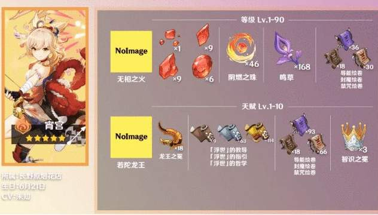
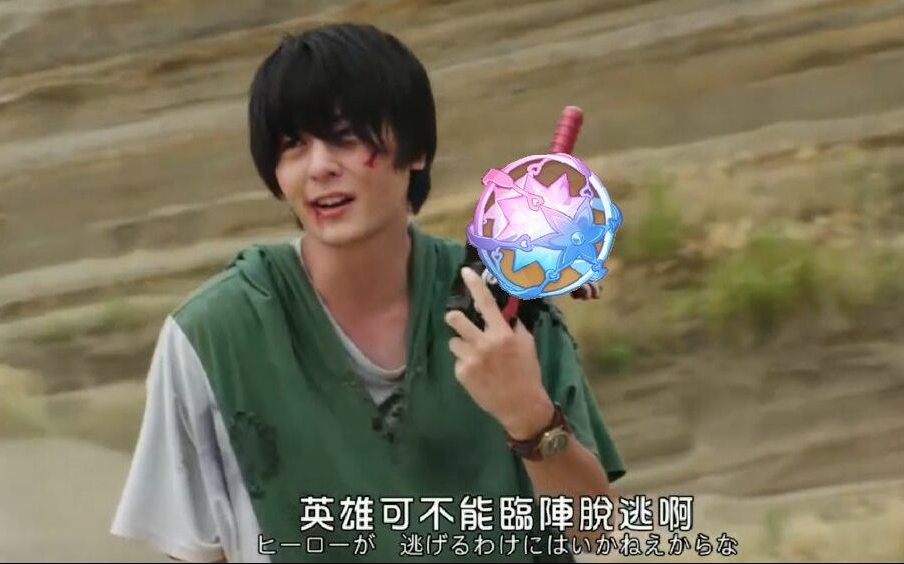

# 宵宫计划

## Mergeable

| 材料名称`\`材料等阶 | I | II | III | IV | V |
| :---------------: | :-: | :-: | :-: | :-: | :-: |
| ~~玛瑙~~ |  - |  1 |   9 | 9 | 6 |
| ~~图腾~~ | 36 | 96 | 129 | - | - |
| 天赋书 · 浮世 | - | `3/`3×3=9 | `21/`21×3=63 | `47/`38×3=114 | - |

## Non-mergeable

| 突破阶数`\`材料名称 | 阴燃之珠 | 鸣草 | 经验书 |
| :---------------: | :------: | :-: | :----: |
| 1阶`lv20` |  0 |   3 |   6 |
| 2阶`lv40` |  2 |  13 |  35 |
| 3阶`lv50` |  6 |  33 |  64 |
| 4阶`lv60` | 14 |  63 | 107 |
| 5阶`lv70` | 26 | 108 | 167 |
| 6阶`lv80` | 46 | 168 | 248 |
| ***Current*** | ***49*** | ***184*** | ~~367~~ |
| 终段`lv90` | - |  -  | 420 |

